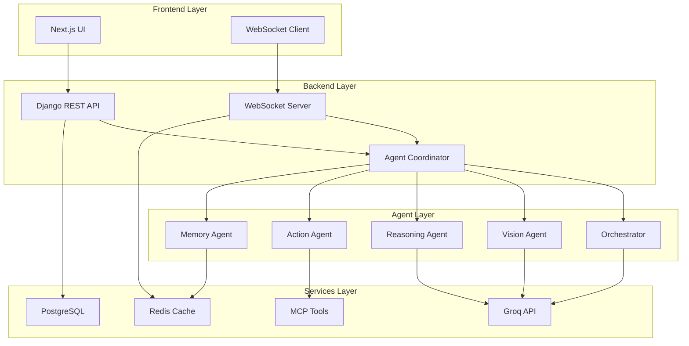

# 🚀 Multi-Agent Orchestration System

> **Public Beta** — Build and run multi-agent workflows with Groq-powered inference. Core flows (auth, agents, chat, automations) are usable; advanced modules are still maturing.


## Current Product Surface

Current beta paths available in the main app:

- Dashboard + Workspace
- Email / Google / GitHub auth
- Agents + Chat + Automations + Workflows
- Integrations + MCP Tools + Data Pipelines + Plugins + Webhooks
- Analytics + Coordination + Intelligence + Reports + Notifications
- Settings + Billing (Stripe checkout when configured)
- Privacy Policy + Terms pages

Positioning note: several modules are still beta-quality, but they are visible in primary navigation and should be documented as shipped UI surface.

## What's included

### Multi-Model Intelligence
- **Providers**: Groq, OpenAI, Anthropic (when keys are configured)
- **Routing / fallback**: available in the intelligence modules; polish ongoing

### Agent Learning & Azure / notifications
- Present in the codebase; treat as experimental during beta

### Security
- **OAuth2 & JWT** authentication
- **API keys** and rate limiting
- **Quota enforcement** on agent message endpoints
- Set `DEBUG=False` and a strong `SECRET_KEY` before any public deploy

### Workflow Automation
- Zapier / Make-oriented hooks exist; verify end-to-end before promising to customers

## Documentation

- **[Kubernetes Guide](k8s/README.md)** - Deployment sketches
- Copy `backend/.env.example` → `backend/.env` and fill real keys before launch

> Note: older doc links (`QUICK_START.md`, `SETUP_GUIDE.md`, etc.) may be missing; use `.env.example` and Docker Compose as the source of truth.

## 🏗️ Architecture



## 🚀 Quick Start

### Prerequisites

- Docker & Docker Compose
- Node.js 20+ (for local development)
- Python 3.11+ (for local development)
- Git

### 1. Clone the Repository

```bash
git clone https://github.com/yourusername/multi-agent-orchestration-system.git
cd multi-agent-orchestration-system
```

### 2. Set Up Environment Variables

```bash
# Backend environment
cp backend/.env.example backend/.env

# Frontend environment
cp frontend/.env.example frontend/.env.local

# Edit backend/.env with your API keys
# Required: GROQ_API_KEY
# Optional: OPENAI_API_KEY, AZURE_API_KEY
```

### 3. Backend Setup

```bash
cd backend

# Create and activate virtual environment
python -m venv venv

# Windows
venv\Scripts\activate

# Linux/Mac
source venv/bin/activate

# Install dependencies
pip install -r requirements.txt

# Run database migrations
python manage.py migrate

# Create superuser (optional)
python manage.py createsuperuser

# Start development server
python manage.py runserver
```

### 4. Frontend Setup

```bash
cd frontend

# Install dependencies
npm install

# Start development server
npm run dev
```

### 5. Access the Application

- **Frontend**: http://localhost:3000
- **Backend API**: http://localhost:8000
- **Admin Panel**: http://localhost:8000/admin

## 🛠️ Development

### Project Structure

```
├── backend/                    # Django REST API
│   ├── agents/                # Multi-agent system core
│   ├── authentication/        # User authentication
│   ├── api_integrations/      # External API integrations
│   ├── Mcp_Integration/       # Model Context Protocol
│   ├── Multi_agents_cordination/
│   ├── Multi_model_Intelligence/
│   ├── real_time_performance/
│   ├── reporting/
│   ├── notifications/
│   ├── data_pipelines/
│   └── use_case/
├── frontend/                  # Next.js React application
│   ├── src/
│   ├── public/
│   └── components/
└── README.md
```

### Backend Development

```bash
cd backend

# Install dependencies
pip install -r requirements.txt

# Run migrations
python manage.py migrate

# Start development server
python manage.py runserver

# Run tests
python manage.py test

# Create new Django app
python manage.py startapp your_app_name
```

### Frontend Development

```bash
cd frontend

# Install dependencies
npm install

# Start development server
npm run dev

# Build for production
npm run build

# Run linting
npm run lint
```

### Development Tools

- **Backend**: Django 5.1.5, Django REST Framework, Channels (WebSocket)
- **Frontend**: Next.js 16.x, React 19.x, TailwindCSS, shadcn/ui
- **Database**: SQLite (development), PostgreSQL (production)
- **Real-time**: WebSocket, Django Channels
- **AI Integration**: Groq API, OpenAI API

## 📚 API Overview

### Core Endpoints

```bash
# Agent Management
GET /agents/api/agents/          # List all agents
POST /agents/api/agents/         # Create new agent
GET /agents/api/agents/{id}/     # Agent details

# Session Management  
POST /agents/api/sessions/       # Create session
GET /agents/api/sessions/{id}/   # Session details
POST /agents/api/sessions/{id}/send_message/  # Send message

# Authentication (frontend-facing)
POST /api/auth/v2/login/         # Email/password login
POST /api/auth/v2/register/      # Email/password registration
POST /api/auth/refresh/          # Token refresh
GET  /api/auth/me/               # Current user profile

# OAuth
GET /api/auth/google/            # Start Google OAuth
GET /api/auth/github/            # Start GitHub OAuth

# Billing
GET /api/billing/status/         # Usage + subscription status
```

### WebSocket Connections

```javascript
// Connect to WebSocket
const ws = new WebSocket('ws://localhost:8000/ws/session/<session_id>/');

// Send message
ws.send(JSON.stringify({
  type: 'message',
  content: 'Hello, agents!'
}));
```

Quota semantics: backend enforcement is currently monthly **messages** per workspace (free: 100, pro: 10,000, premium: 1,000,000).

## 🧪 Use Cases

### 1. Document Processing Workflow
- **Vision Agent**: OCR and layout analysis
- **Reasoning Agent**: Content understanding
- **Memory Agent**: Knowledge extraction
- **Action Agent**: Data export and integration

### 2. Customer Service Automation
- **Orchestrator**: Request routing
- **Reasoning Agent**: Intent classification
- **Memory Agent**: Customer history
- **Action Agent**: System integration

### 3. Research Assistant
- **Reasoning Agent**: Query analysis
- **Action Agent**: Information gathering
- **Memory Agent**: Knowledge synthesis
- **Orchestrator**: Report generation

## 🔧 Configuration

### Required Environment Variables

#### Backend (.env)
```env
# Security
SECRET_KEY=your_secret_key_here
DEBUG=True

# API Keys (Required for AI features)
GROQ_API_KEY=your_groq_api_key_here

# Optional API Keys
OPENAI_API_KEY=your_openai_api_key_here
AZURE_API_KEY=your_azure_api_key_here

# Database (SQLite for development)
DATABASE_URL=sqlite:///db.sqlite3
```

#### Frontend (.env.local)
```env
NEXT_PUBLIC_API_URL=http://localhost:8000
NEXT_PUBLIC_WS_URL=ws://localhost:8000
```

### Agent Configuration

```python
# Backend settings for agent behavior
AGENT_CONFIG = {
    'MAX_AGENTS': 10,
    'DEFAULT_TIMEOUT': 30,
    'REASONING_DEPTH': 5
}

GROQ_CONFIG = {
    'MODEL': 'llama-3.3-70b-versatile',
    'TEMPERATURE': 0.7,
    'MAX_TOKENS': 2048
}
```

## 📊 Current Development Status

### ✅ Completed Features
- Multi-agent system architecture
- Django REST API backend
- Next.js frontend with modern UI
- WebSocket real-time communication
- User authentication system
- Basic agent coordination
- File upload and processing

### 🔄 In Development
- Advanced agent reasoning
- Multi-modal processing
- Performance optimization
- Error handling improvements
- Testing coverage
- Documentation

### 📋 Planned Features
- Production deployment setup
- Advanced monitoring
- Plugin system
- Extended AI model support
- Performance analytics dashboard

## 🧩 Contributing

We welcome contributions! This is a development project and we're actively looking for collaborators.

### How to Contribute

1. Fork the repository
2. Create a feature branch (`git checkout -b feature/amazing-feature`)
3. Make your changes
4. Run tests and ensure code quality
5. Commit your changes (`git commit -m 'Add amazing feature'`)
6. Push to the branch (`git push origin feature/amazing-feature`)
7. Open a Pull Request

### Development Guidelines

- **Python**: Follow PEP 8, use Black for formatting
- **TypeScript**: Follow ESLint configuration
- **Commits**: Use conventional commit messages
- **Tests**: Write tests for new features
- **Documentation**: Update README and docstrings

### Areas Needing Help

- 🐛 Bug fixes and testing
- 📝 Documentation improvements  
- 🎨 UI/UX enhancements
- ⚡ Performance optimizations
- 🔧 DevOps and deployment

## � Known Issues

- [ ] Database UUID consistency issues (being addressed)
- [ ] WebSocket connection stability needs improvement
- [ ] File upload size limitations
- [ ] Error handling in agent coordination
- [ ] Performance optimization needed for large datasets

## 🔮 Future Roadmap

### Version 1.0 Goals
- [ ] Stable agent coordination
- [ ] Complete multi-modal processing
- [ ] Production-ready deployment
- [ ] Comprehensive testing suite
- [ ] Performance benchmarks

### Version 2.0 Vision
- [ ] Plugin architecture
- [ ] Advanced monitoring dashboard
- [ ] Multi-tenant support
- [ ] Cloud deployment options
- [ ] More Features

## 📞 Support & Contact

- **Issues**: [GitHub Issues](https://github.com/yourusername/multi-agent-orchestration-system/issues)
- **Discussions**: [GitHub Discussions](https://github.com/yourusername/multi-agent-orchestration-system/discussions)
- **Email**: your-email@example.com

## 📄 License

This project is licensed under the MIT License - see the [LICENSE](LICENSE) file for details.

## 🙏 Acknowledgments

- [Groq](https://groq.com) for high-performance AI inference
- [Django](https://djangoproject.com) for robust backend framework
- [Next.js](https://nextjs.org) for modern frontend framework
- [shadcn/ui](https://ui.shadcn.com) for beautiful UI components
- The open-source community for inspiration and tools

---

<div align="center">
  <strong>🔧 Built for the future of AI collaboration - Currently in active development</strong>
</div>